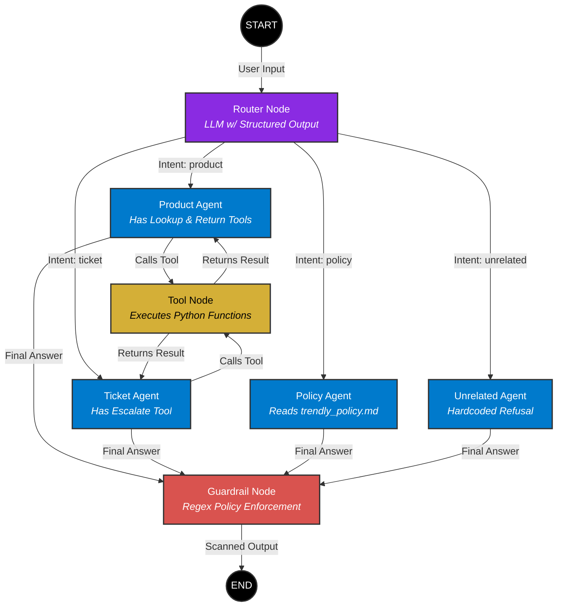

# Trendly LangGraph Architecture

This diagram shows the complete flow of our customer support AI, including the new `UnrelatedAgent` and `GuardrailAgent`.

### Visual Output from LangGraph:
Here is the actual graph generated directly from our LangGraph code:

