# Trendly Agentic Support Assistant

## 📌 Project Overview
An autonomous AI agent built for Trendly to handle customer support inquiries, track orders, process policy queries, and intelligently escalate tickets to humans. 

This project is an advanced multi-agent backend architecture designed to handle customer support interactions efficiently. It operates on a Client-Server model via REST API and leverages Large Language Models (LLMs) using **LangChain** and **LangGraph** to dynamically process, route, and resolve user queries. The system also features a robust ticketing mechanism with Human-In-The-Loop (HITL) confirmation.

---


## 📸 System Previews

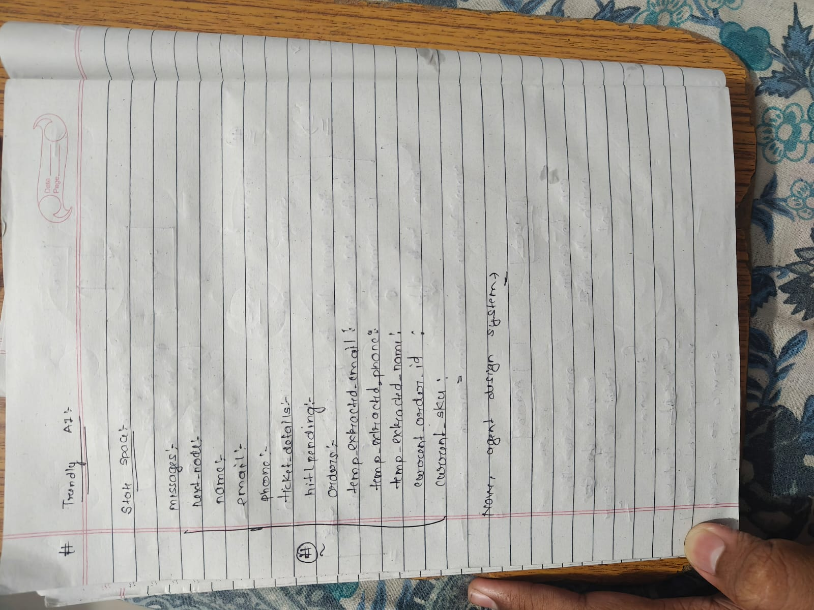
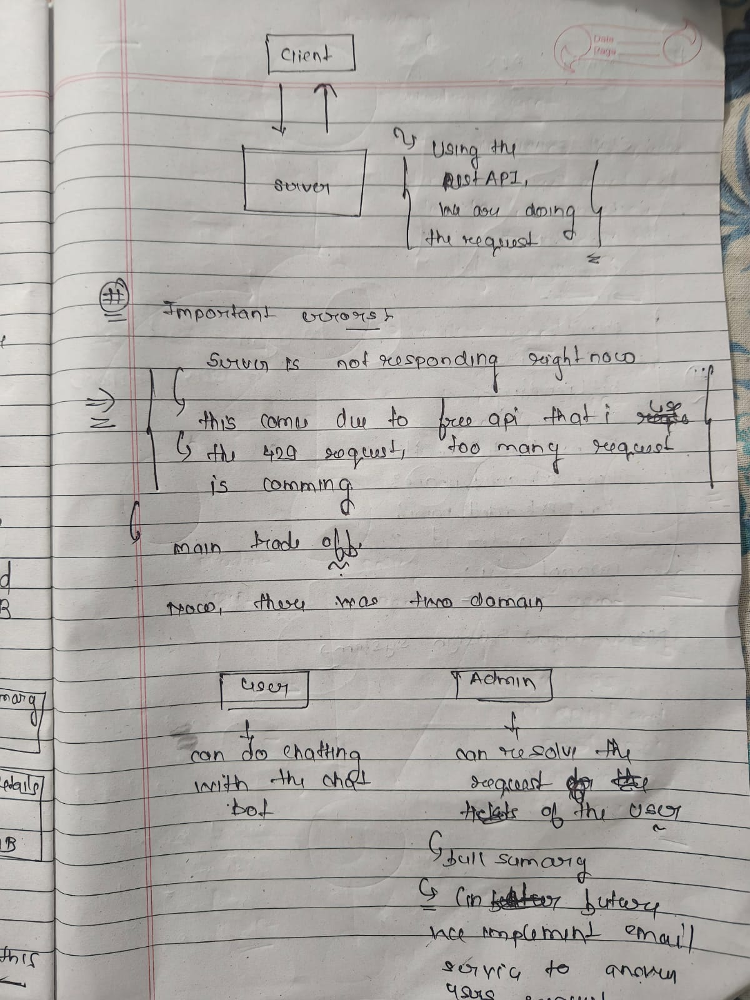
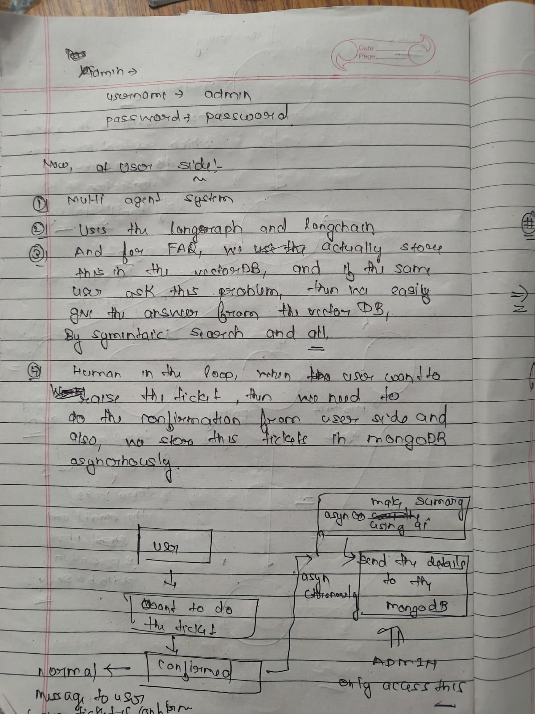
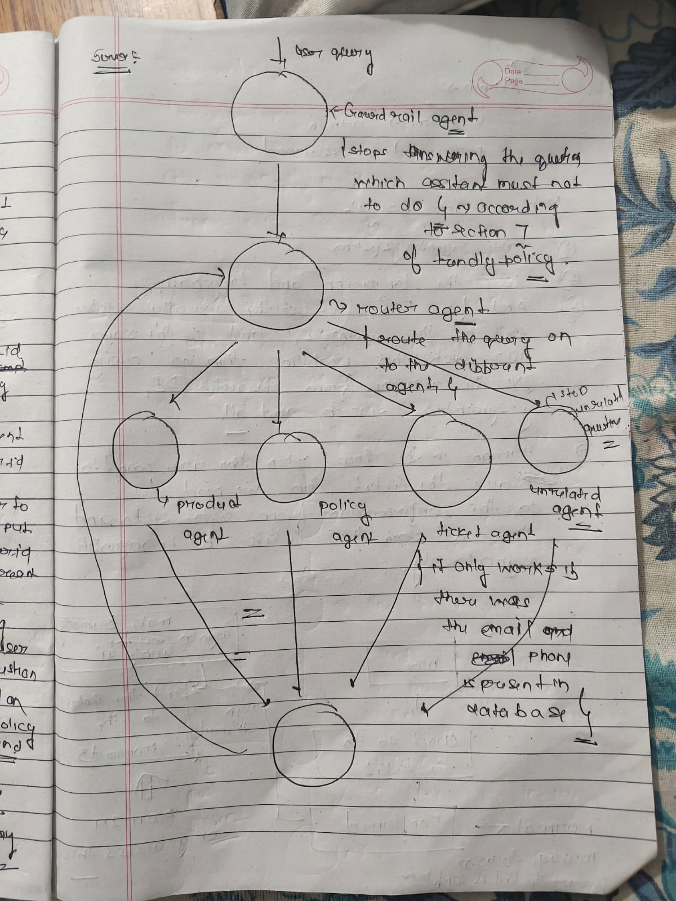
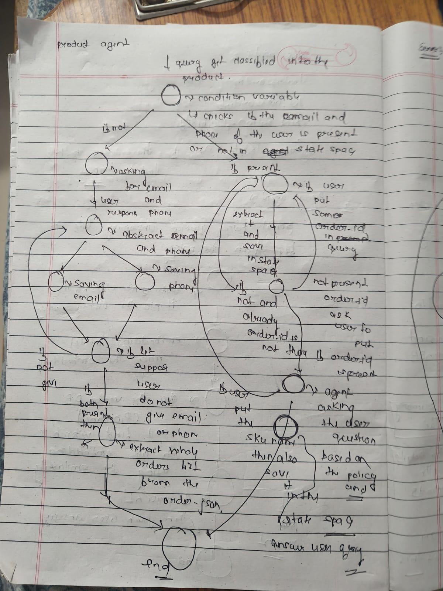
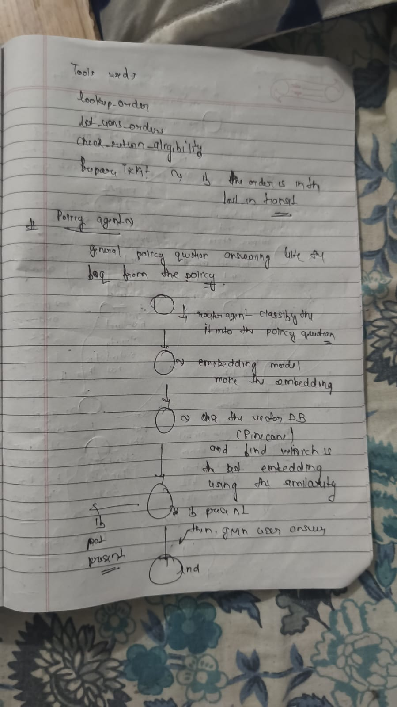
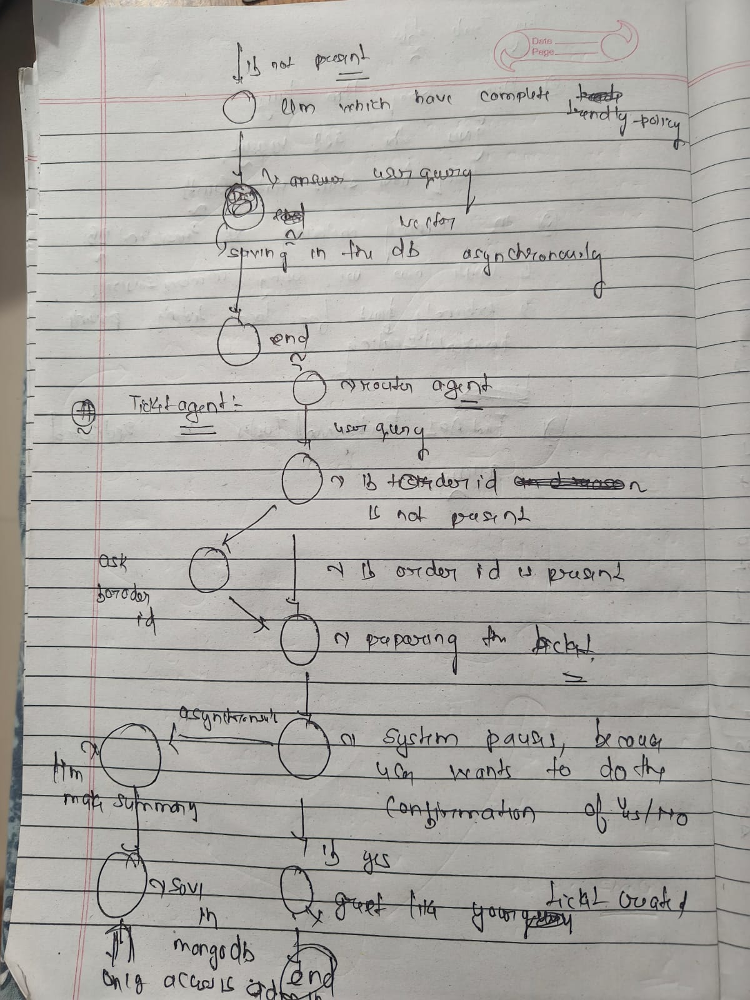
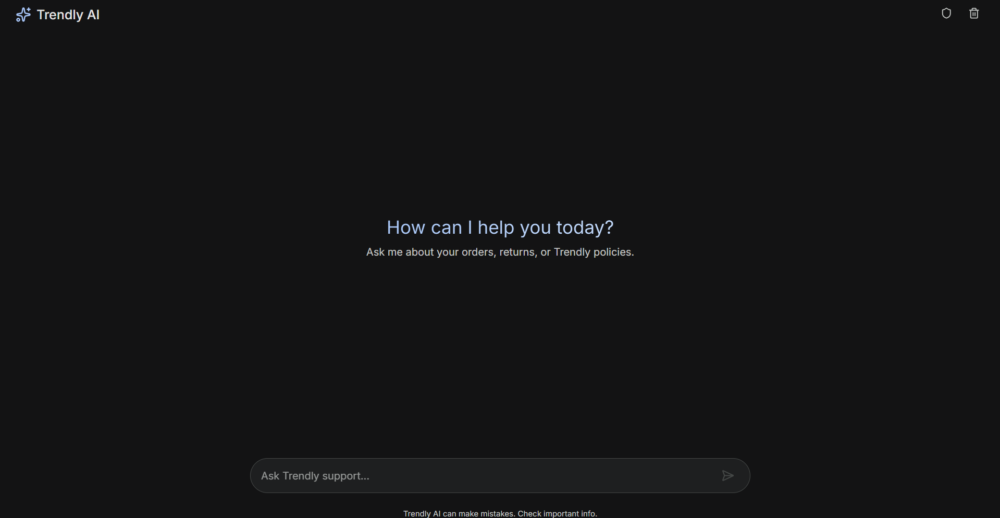
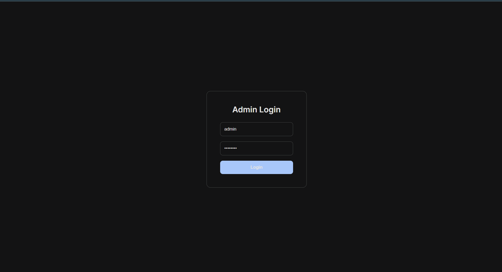
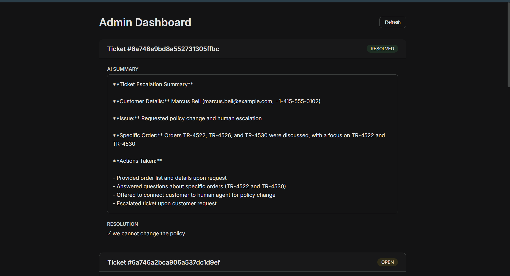


## 🏗️ Architecture & Technologies

- **Frameworks:** FastAPI, LangChain, LangGraph (Multi-Agent System)
- **LLM:** Groq (Llama-3)
- **Databases:** 
  - **Vector Store (PINECONE):** Stores FAQs for Semantic Caching. Uses semantic search to instantly answer recurring user problems.
  - **MongoDB:** Asynchronously stores generated support tickets and AI summaries for Ticket Management.
  - **Redis (For Background services)** : For running the worker , which asynchronously , saves the tickets and summary in the database , we use redis 
- **Data Source:** User profiles and `order.json` (for order history and SKU details).
- **Communication:** REST API.

### Client-Server Architecture
The system operates on a standard Request-Response cycle using REST APIs. 

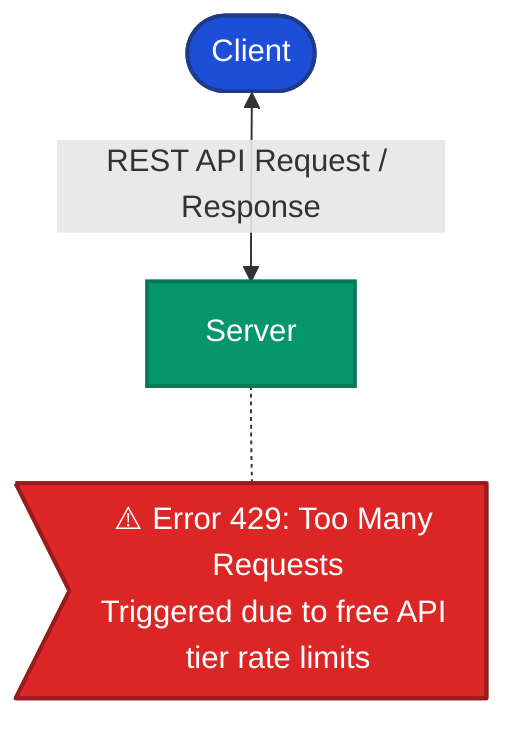

---

## 🚀 Setup Instructions

### 1. Requirements
Ensure you have Python 3.10+ installed.

### 2. Environment Variables
Create a `.env` file in the **backend** directory:
```env
GROQ_API_KEY=your_groq_key
MONGODB_URI=your_mongo_uri
REDIS_URI=your_redis_uri
HUGGING_FACE=your_hf_token
VECTOR_DB=your_vector_db_uri
NOMIC_API=your_nomic_api_key
```

Create a `.env` file in the **frontend** directory:
```env
VITE_API_BASE_URL=http://127.0.0.1:5000/api
```

### 3. Install Dependencies
```bash
python -m venv venv
source venv/bin/activate  # On Windows use `venv\Scripts\activate`
pip install -r requirements.txt
```

### 4. Run the Servers
Use `honcho` to start the backend server and its related processes:
```bash
honcho start
```
Your chat endpoint will be available at `POST http://127.0.0.1:8000/api/chat/` (or as configured in your Procfile).

### 5. Running Tests
You can run the end-to-end test suite included in the repository:
```bash
python test_e2e.py
```

---

## 👥 User Roles & Permissions

1. **User / Client**
   - Interacts with the multi-agent chatbot.
   - Can raise support tickets (requires explicit Yes/No confirmation).
2. **Admin**
   - **Credentials:** `username: admin` | `password: password`
   - Has exclusive access to view and resolve user tickets stored in MongoDB.
   - Views AI-generated ticket summaries.
   - *Future Scope:* Implement an email service for admins to directly answer users.

---

## 🤖 Multi-Agent Workflow

The core of the application relies on an intelligent routing mechanism that analyzes the user query and directs it to the appropriate specialized agent. 

### 1. The Core Routing Flow (ReAct System)
The multi-agent system operates in a **Reasoning and Acting (ReAct) loop**. Once a query is processed and answered by a specific agent, the workflow concludes the cycle and loops back, ready to accept and route the next user query.

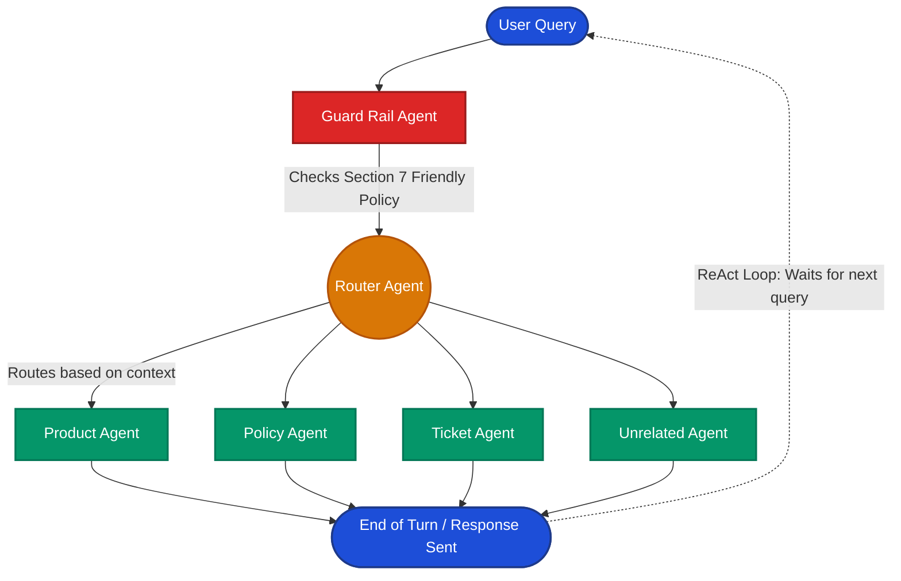

---

### 2. Product Agent Logic
The Product Agent handles order-specific inquiries. It intelligently extracts order details and scopes the prompt to specific orders when available.

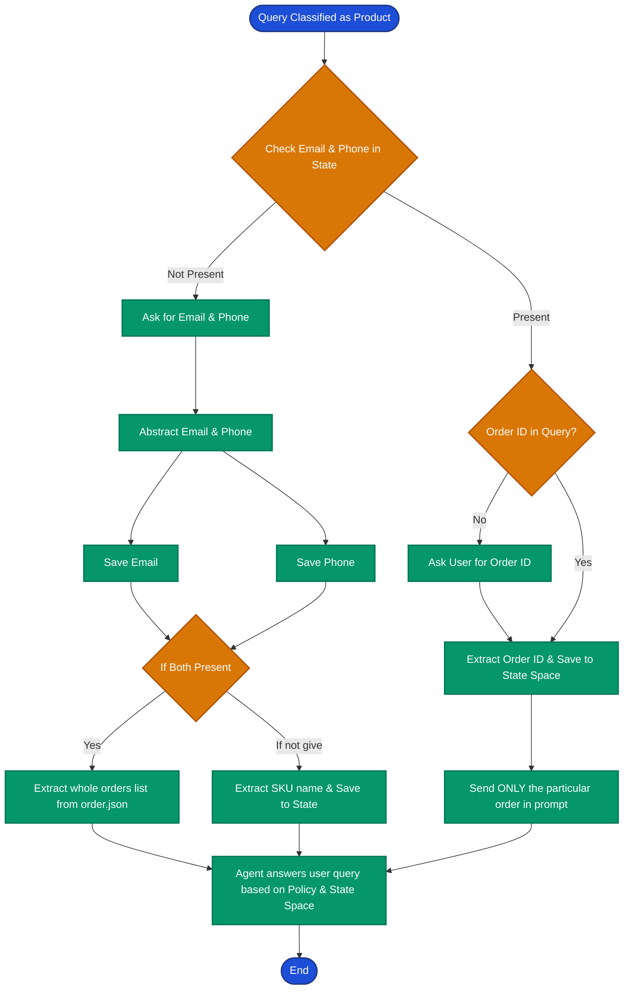

---

### 3. Ticket Agent & Human-in-the-Loop (HITL)
If a user needs to raise a ticket, the system ensures they actually want to proceed by pausing execution and waiting for user confirmation.

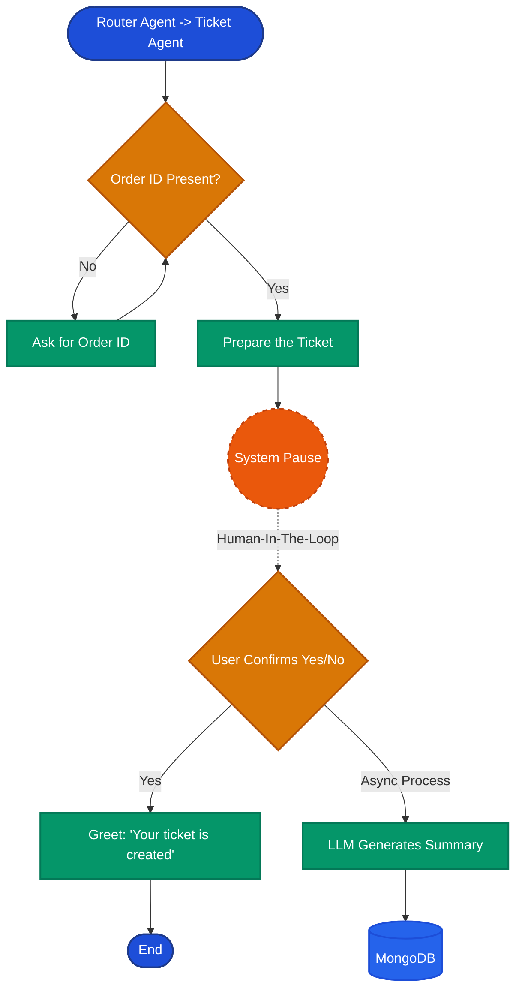

---

### 4. Policy Agent Logic
Handles queries related to general policies and FAQs. Checks the VectorDB first; if not found, routes to a policy-aware LLM.

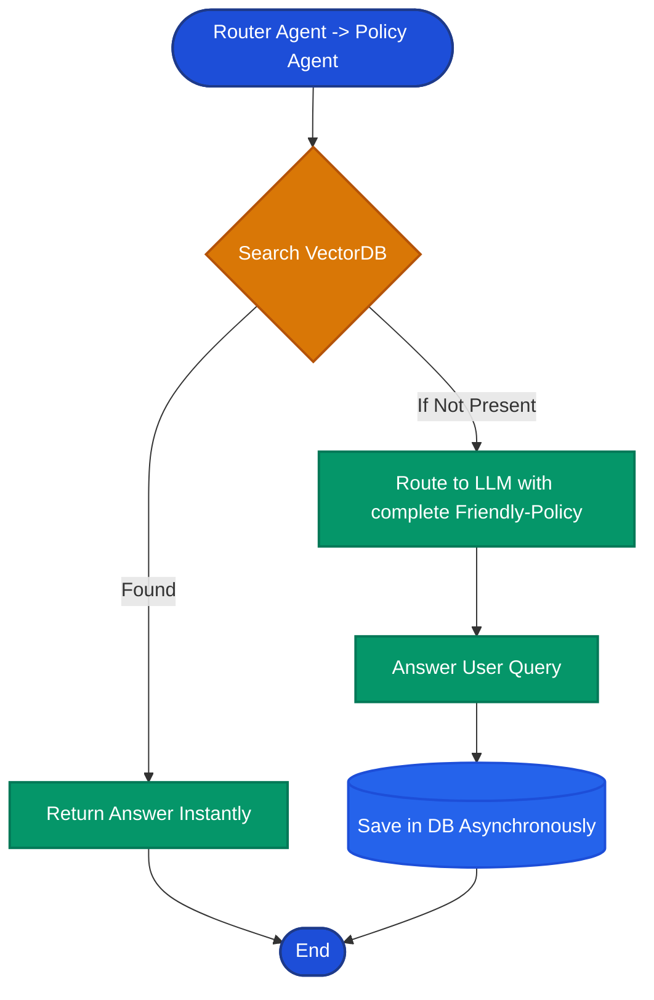

---

## 🤖 AI-Usage Note
This project was built with the assistance of advanced LLMs (Claude/GPT) for:
- Writing boilerplate FastAPI routes and Pydantic schemas.
- Refactoring the LangGraph multi-agent architecture (splitting monolithic agents into smaller specialized nodes).
- Debugging edge cases like Pydantic AttributeErrors and Groq tool-calling JSON parsing failures.
- Designing the Semantic Caching layer with LangChain Redis.

## Render Problem 
- It Might we chance that the you did not get the message too fast in the first attempt , because the i deploy on the render server , and it takes 50 sec time to wakes up

*Human oversight was strictly maintained to enforce guardrails, structure the conversational state graph, and design the HITL (Human-in-the-Loop) intercepts.*
